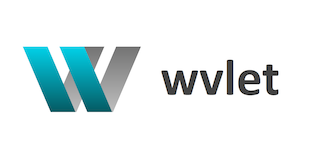

wvlet [![Maven Central][central-badge]][central-link] [![GitHub Actions][gha-badge]][gha-link] [![Coverage Status][coverall-badge]][coverall-link]
==========================================

[coverall-badge]: https://coveralls.io/repos/github/wvlet/wvlet/badge.svg?branch=master
[coverall-link]: https://coveralls.io/github/wvlet/wvlet?branch=master

[gha-badge]: https://github.com/wvlet/wvlet/workflows/CI/badge.svg
[gha-link]: https://github.com/wvlet/wvlet/actions?workflow=CI

[central-badge]: https://img.shields.io/maven-central/v/org.wvlet/wvlet-core_2.12.svg?label=maven%20central
[central-link]: https://search.maven.org/search?q=g:%22org.wvlet%22%20AND%20a:%22wvlet-core_2.12%22

wvlet, pronounced as _weave-let_, is an open-source functional dataflow builder.

